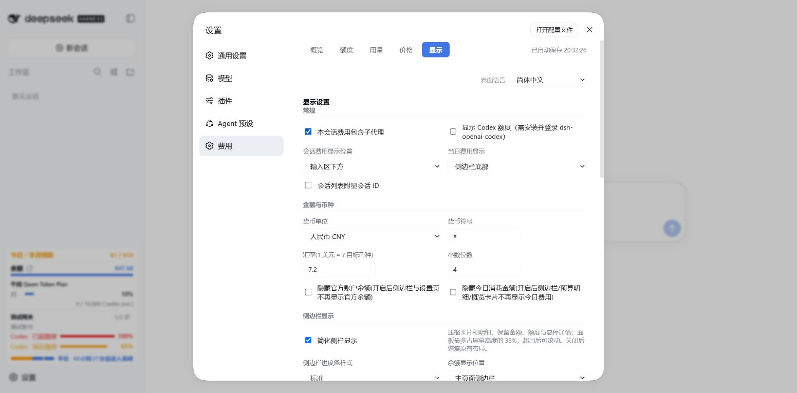

# v1.7.21 验证记录

本次处理 #127–#130，并整合 PR #124、#125。截图和 HTTP 响应均为隔离环境的合成数据。

- `test/session-restart.mjs`：真实 DSH 0.1.5-rc.1 的 Session 与 SessionProjectionRegistry，比较普通重启、fork、自身重启、checkpoint 增量与全量恢复。宿主给普通恢复传入 `inheritedEventCount=0`，插件以前忽略此参数，误把 `session/end-seed` 之前的调用扣除；现在使用初始化参数并让旧 checkpoint 重放。
- `test/subagent-billing.mjs`：跨日期父/子/孙费用、连续血缘、普通 fork 和循环排除、API/Plan 拆分、目录降级、配置保存与 RPC。合并只作用于会话显示，不写父账本。
- `test/native-search-billing.mjs`：Node 20/22/24 的真实本地 HTTP fetch；同 token 并发请求、取消、卸载恢复、大小限制、用量缺口持久化，及 USD/CNY、峰谷下实时账本与日志回放/投影一致。
- `test/client-issues-127-129.mjs`：会话切换与迟到响应、子代理开关、Codex 关闭时零请求与在途关闭后重新启用、网关同名账号/重排/空账号/窄栏键盘切换，以及 Astra 前后端计价一致。
- `test/gpt-astra-pricing.mjs`：缓存写入独立价、272,000/272,001 输入边界、缓存推动跨档、输出不参与阈值、多次短请求的聚合不误涨价。

完整入口为 `node test/verify.mjs`，分别设置 `TZ=Asia/Shanghai` 和 `TZ=UTC`。实际宿主恢复测试可设置 `DSH_TEST_NODE_MODULES` 指向安装了 DSH 0.1.5-rc.1 的隔离 `node_modules`。

浏览器验收使用隔离 DSH 0.1.5-rc.1、合成三账号网关额度和本地账本。已检查同卡 100% 为红色、85% 为橙色，空账号保留切换入口，Enter 与窄栏切换，刷新后的账号选择，子代理开关自动保存及实际落盘。未开启 Codex 额度时没有控制台错误。构建压缩 CSS 和 RPC 公共字段后，全部样式与接口仍包含在客户端内。

历史搜索没有保存真实 usage 时无法补算；缺少父子目录元数据时不猜测子代理关系。详细搜索边界见 [原生搜索计费](native-search-billing.md)，价格来源见 [Astra 定价核验](gpt-astra-pricing.md)。
