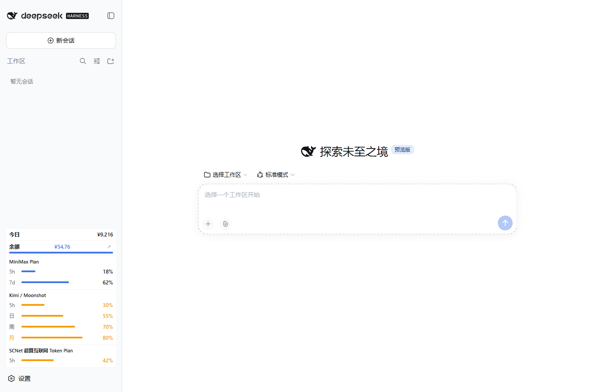
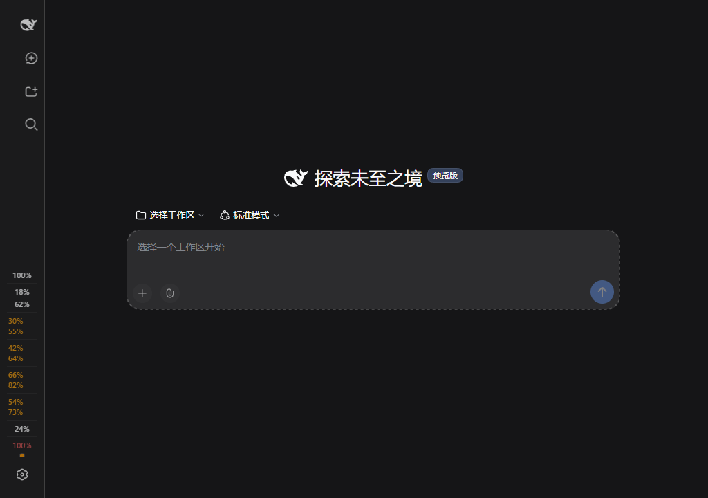

# 简化侧栏显示

更新后首次打开页面，会提示选择「开启简化显示」或「保留当前显示」。选择会保存到当前 DSH Profile 的配置；刷新或重启后不重复询问。保存失败时保留提示并允许重试。

之后可在 **设置 → 费用 → 显示 → 简化侧栏显示** 中随时切换，设置自动保存。

- 默认保持现有布局，等待用户选择。开启简化后以细分隔线整理卡片，压缩内边距、进度条及重复明细。
- 今日费用固定在面板顶部（遵守「隐藏今日消耗」开关）。余额、额度百分比、预警颜色、点击刷新和悬停详情继续保留。
- 面板高度最多占视口的 38%，并以 320 像素为上限；更多额度在面板内滚动查看。可用 Tab 聚焦面板，再用方向键、Page Down 或 End 滚动。
- 原有「标准 / 紧凑两列」偏好被保留，在简化模式下暂不可调整；关闭简化模式后恢复原有样式。
- 展开侧栏、收起窄栏、中英文和亮暗主题均支持。新的选择提示先于旧的额度横条/点击刷新引导显示，避免重叠。

## 验证记录

在隔离的 DSH `0.1.5-alpha.1` 中使用合成余额、五家 Coding Plan、Go 和预算数据验证，未修改日常 Profile 或真实账本。1366 × 900 视口下，原紧凑布局高 626.19 像素，简化布局高 320 像素，占用减少约 49%；这是该示例配置的测量结果。1024 × 720 视口下为 273.59 像素，符合 38% 上限；收起窄栏宽 48.81 像素，没有横向溢出。

实际页面验证了首次开启、刷新保留选择、设置自动保存及布局恢复、键盘滚动、固定今日金额、悬停详情、英文及深色窄栏。浏览器无 JavaScript 运行错误。`test/sidebar-simple.mjs` 另覆盖拒绝开启、失败重试、防重复提交、RPC 字段、账本重启持久化及新旧引导顺序；完整回归在 Asia/Shanghai 与 UTC 通过。

## English

After the update, choose **Enable simple display** or **Keep current display**. The choice is saved per DSH Profile and survives reloads and restarts. You can change it later in **Settings → Cost → Display → Simplify the sidebar**.

Simple display condenses card spacing and repeated details, keeps the daily amount at the top, and retains balances, quotas, warning colors, refresh actions and hover details. Its height is capped at 38% of the viewport and 320 pixels; scroll inside the panel to see more quotas. Tab focuses the panel for keyboard scrolling. Your original Standard / Compact preference is restored when you turn simple display off.

Screenshots use synthetic data. Verification used an isolated DSH `0.1.5-alpha.1` profile, including persistence, settings changes, keyboard scrolling, English, dark mode and the collapsed rail.
