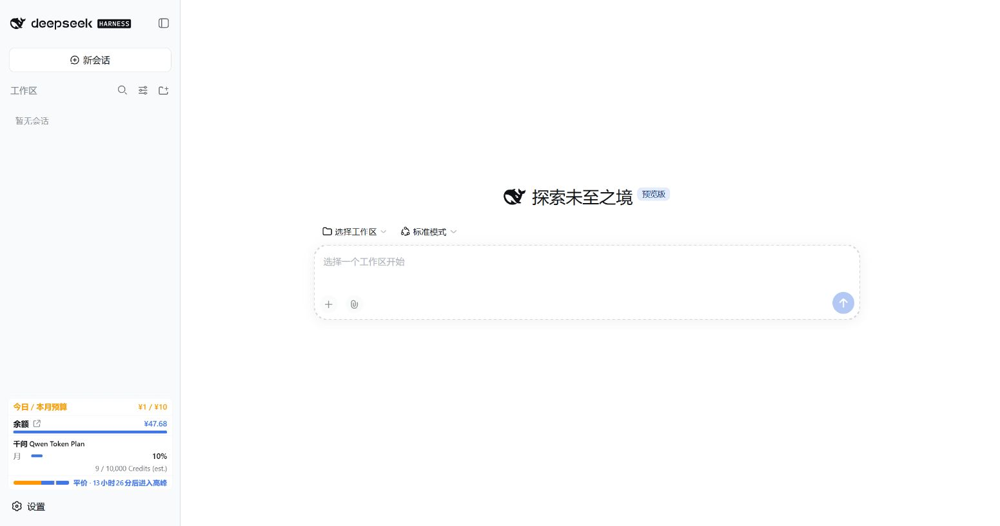

# 简化侧栏显示

更新后首次打开页面，会提示选择「开启简化显示」或「保留当前显示」。选择会保存到当前 DSH Profile 的配置；刷新或重启后不重复询问。保存失败时可重试，也可用关闭按钮或 Escape 关闭提示。关闭状态保存在同源浏览器本地，刷新后不反复出现；它不修改实际显示配置，也不代表服务端保存成功。

之后可在 **设置 → 费用 → 显示 → 简化侧栏显示** 中随时切换，设置自动保存。

- 默认保持现有布局，等待用户选择。开启简化后以细分隔线整理卡片，压缩内边距、进度条及重复明细。
- 今日费用固定在面板顶部（遵守「隐藏今日消耗」开关）。开启预算时合并显示为「今日 / 本月预算 · ¥1 / ¥10」等形式，周期由预算配置决定，预警仍按该周期实际已用金额计算，完整明细可悬停查看。余额、额度百分比、预警颜色、点击刷新和悬停详情继续保留。
- 面板高度最多占视口的 38%，并以 320 像素为上限；更多额度在面板内滚动查看。可用 Tab 聚焦面板，再用方向键、Page Down 或 End 滚动。
- 简化宽栏始终保留原本应显示的峰谷条，预算合并或未开启预算均不会丢失；峰谷开关和样式仍有效。余额金额右对齐，标签旁的矢量图标打开充值页；额度行缩减留白，提示展开时分隔线保持稳定。
- 原有「标准 / 紧凑两列」偏好被保留，在简化模式下暂不可调整；关闭简化模式后恢复原有样式。
- 展开侧栏、收起窄栏、中英文和亮暗主题均支持。新的选择提示先于旧的额度横条/点击刷新引导显示，避免重叠。

## v1.7.20 验证补充

隔离 DSH 0.1.5-rc.1 中验证了正常配置保存与模拟 RPC 拒绝后的关闭、刷新保留关闭状态、无预算峰谷条及今日/预算合并。余额和额度百分比右边缘一致；提示展开前后两张卡片的位置、高度和分隔线完全一致。该测试只验证这些实际路径，不推断 #121 原用户的具体保存失败原因。自动回归覆盖 256 种显示组合与日/月/累计/自定义预算周期。

## v1.7.19 验证记录

在隔离的 DSH `0.1.5-alpha.1` 中使用合成余额、五家 Coding Plan、Go 和预算数据验证，未修改日常 Profile 或真实账本。1366 × 900 视口下，原紧凑布局高 626.19 像素，简化布局高 320 像素，占用减少约 49%；这是该示例配置的测量结果。1024 × 720 视口下为 273.59 像素，符合 38% 上限；收起窄栏宽 48.81 像素，没有横向溢出。

实际页面验证了首次开启、刷新保留选择、设置自动保存及布局恢复、键盘滚动、固定今日金额、悬停详情、英文及深色窄栏。浏览器无 JavaScript 运行错误。`test/sidebar-simple.mjs` 另覆盖拒绝开启、失败重试、防重复提交、RPC 字段、账本重启持久化及新旧引导顺序；完整回归在 Asia/Shanghai 与 UTC 通过。

## English

After the update, choose **Enable simple display** or **Keep current display**. The choice is saved per DSH Profile and survives reloads and restarts. If saving fails or stalls, use the close button or Escape to dismiss the guide. Dismissal is remembered in the same browser origin without claiming the settings were saved. You can change it later in **Settings → Cost → Display → Simplify the sidebar**.

Simple display condenses card spacing and repeated details, keeps the daily amount at the top, and retains balances, quotas, warning colors, refresh actions and hover details. Its height is capped at 38% of the viewport and 320 pixels; scroll inside the panel to see more quotas. Tab focuses the panel for keyboard scrolling. When a budget is enabled, the daily amount and the budget share one summary with the budget period visible. Warning colors still use spending over that budget period. Peak/off-peak strips remain available without a budget. Balance amounts align right, and hover details no longer disturb card separators. Your original Standard / Compact preference is restored when you turn simple display off.

Screenshots use synthetic data. Verification used an isolated DSH `0.1.5-alpha.1` profile, including persistence, settings changes, keyboard scrolling, English, dark mode and the collapsed rail.
